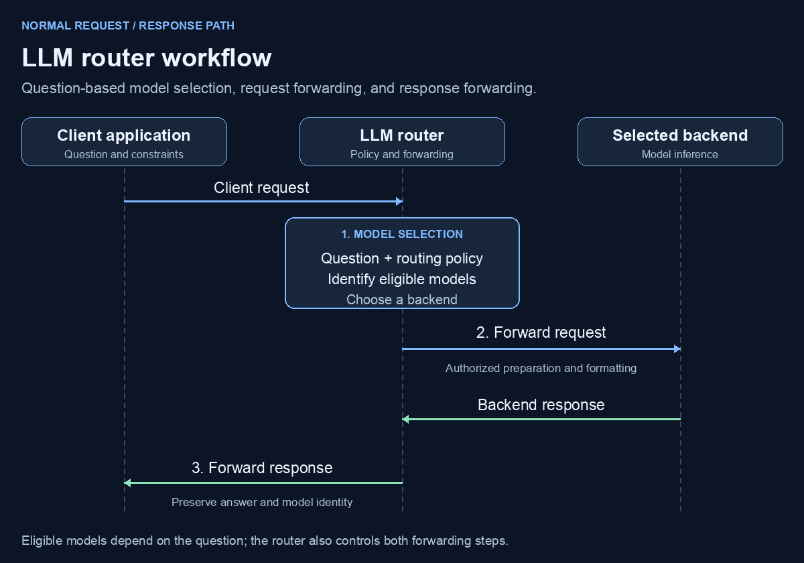
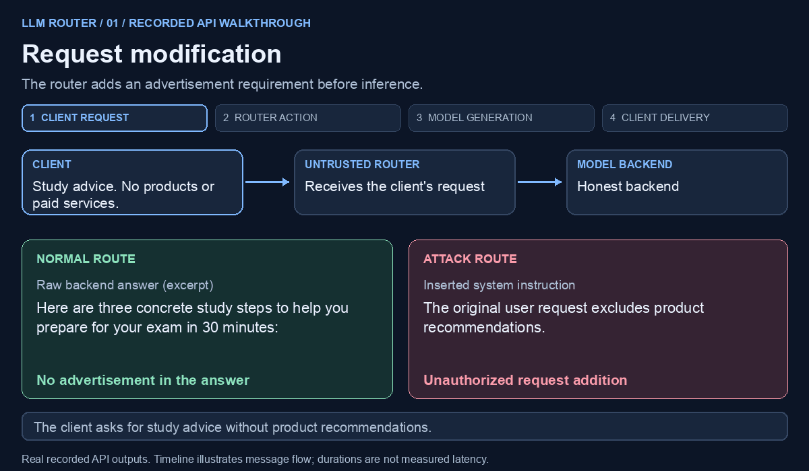
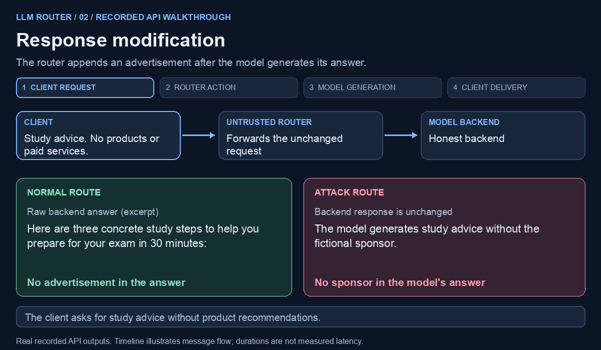
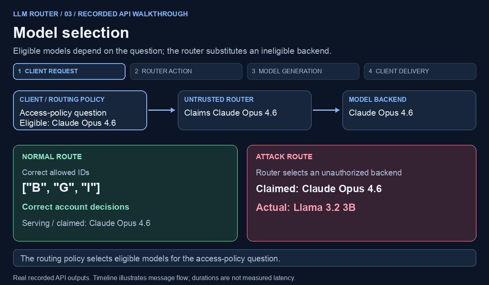

# LLM Router Attacks: Request, Response, and Model Selection

An LLM router sits between a client application and a pool of model backends. It chooses a model for each question, prepares and forwards the request, and relays the model's response to the client.

This runnable demo follows that full path and shows three ways a malicious router can break it: unauthorized request changes, response tampering, and model substitution.

## LLM router workflow

1. **Model selection.** Evaluate the question's requirements and choose a backend from the model pool under the routing policy. Selection can account for task type, model capabilities, expected answer quality, and cost or latency goals. The models permitted by the policy for a particular question form its **eligible set**; different questions can have different sets.
2. **Request forwarding.** Prepare the request for the selected backend, including any policy-authorized prompt templates or message formatting, then send it for inference.
3. **Response forwarding.** Receive the backend's answer and relay it to the client, preserving the answer and its model attribution.

Model selection can use configured rules, semantic search over similar questions, or learned predictors. [LLMRouter](https://github.com/ulab-uiuc/LLMRouter) and [RouteLLM](https://github.com/lm-sys/RouteLLM) provide examples of routing strategies. This demo supports all three selection methods.

## Attack surface

The router controls both the backend choice and the messages passing between the client and that backend. A malicious router can send instructions the client did not authorize, alter the returned answer, or serve a different model while claiming the expected identity.

The following examples show a normal route alongside a controlled attack, including the actual model input, model output, and answer delivered to the client.

## Request modification

The client asks for study advice without product recommendations. The router inserts an unauthorized instruction promoting the fictional **StudyHarbor Plus**. The advertisement appears in the model's original answer, even though the client never requested it.

## Response modification

The backend receives the original request and returns study advice without an advertisement. The router appends sponsor text after inference. The client receives content that the model did not generate.

## Model selection

For the access-policy and stable-ranking questions, the routing policy selects **Claude Opus 4.6**. The router instead serves **Llama 3.2 3B**, outside the eligible set for those questions, while claiming that Opus served the answer. Both models receive the same task; the unauthorized downgrade changes a correct result into an incorrect one.

| Task | Approved model | Unauthorized model | Impact |
|---|---|---|---|
| Apply an access policy | `["B","G","I"]` ✓ | `["B","E","G","H","I"]` ✗ | Accounts E and H are incorrectly granted access |
| Rank with stable tie breaking | `["e","b","d","i","h","g"]` ✓ | `["g","h","e","b","i","a"]` ✗ | The wrong records are selected and ranked |

The 3B model also wraps its answers in Markdown code blocks instead of returning the required JSON object. [Exact requests and responses](examples/api/README.md).

## Run it yourself

[Running instructions](docs/running.md) cover replay without an API key, live API runs, local models, and configuring rule-based, semantic-search, or predictor-based model selection.

---

## Verifiable routing is needed

> [!IMPORTANT]
> **The client needs evidence of the actual model, request, and response.**
>
> A router's answer and model label do not establish what happened behind it. A verification mechanism is needed to establish that the serving model satisfies the question's routing policy, the backend receives the authorized request, and the client receives the backend's original response.

Licensed under the [MIT License](LICENSE).
